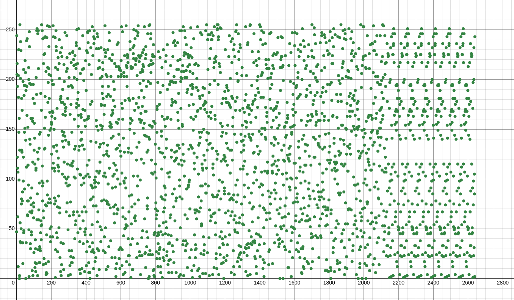
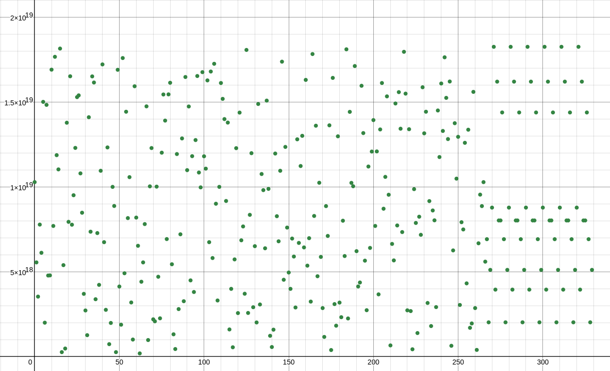

# Encryption and decryption programs

This is a simple (or not) encryption and decryption programs


# Ready to start
```console
$ make all
```

## Best config:

- NB_OCTET   =2
- PUI_ENCRYPT=2
- NB_CLEF    =100

## Wrong configuration

- NB_OCTET   =1
- PUI_ENCRYPT=2
- NB_CLEF    =1

The number of bytes it's not enought to differentiate all the ASCII carracter stored

  
## To accept a certain wrong bit

Set this value as you want:

- EPSILON=0.75

It's a ratio like SNR


## results of increasing NB_OCTET 

start from 1 up to 8 wich represent a 64bit value

|  visual length   | nb bit |      decimal representation      |
|------------------|--------|----------------------------------|
| 28               | 8bit   | (0 -                        255) |
| 63d7             | 16bit  | (0 -                     65 535) |
| 2da435           | 24bit  | (0 -                 16 777 215) |
| 1f8fb78f         | 32bit  | (0 -              4 294 967 295) |
| 4855a7ebfd       | 40bit  | (0 -          1 099 511 627 775) |
| 4f554086a2b3     | 48bit  | (0 -        281 474 976 710 645) |
| 032006e3aad67f   | 56bit  | (0 -     72 057 594 037 927 936) |
| 3577179b3cb5a7ba | 64bit  | (0 - 18 446 744 073 709 551 616) |


# How to use it

```console
$ ./encrypt Hello world (press Crtl-D to escape)
$ > 1f f3 30 0f 1a a2 27 7d a4 42 25 59 ce ec cd d4 1f fb be e1 e9 96 64 45 4e e9 9a a3 99 96 6e ea 82 21 19 91 67 73 32 21 ba a8 8b bd 63 3c c2 28 97 78 88 8a 63 35 5e e1 c1 16 67 74 35 51 16 6c a4 46 66 6b 2c c3 3d d4 13 33 38 87 dc ce e9 99 91 10 09 92 f1 11 16 67 0b ba ac c6 2c ce e2 2e 30 02 24 40 d6 66 6a ab 84 4d d7 77 98 88 87 77 2d d9 9c ca 24 40 05 52 d0 00 07 79 4c cc cd d9 3e e2 2c cf 74 42 2d d2 1b b9 9a ae 5d de eb b0 5d d9 91 17 6a a3 35 51 f7 75 59 9a df fa aa a8 d1 16 67 72 b1 1e e5 58 43 36 6d d0 68 8e ef fd 15 54 43 39 04 4d d4 45 9e e0 06 69 b9 9a aa a4 31 11 11 19 b1 13 3f f0 96 69 93 3d c2 21 1a ab a2 25 55 57 a2 24 40 03 ee ef fd d9 d2 27 79 98 78 8a aa ae 73 3d d5 51 6b b0 00 0f a6 64 47 78 97 7d da a3 3b b0 08 89 f3 31 15 52 d6 60 07 73 af f3 35 5b 0e eb b0 00 33 3f f2 23 0c cc c7 73 78 8e e5 51 2b b4 4b be ec c7 71 1b 4a a4 4c c4 dd d3 31 16 2f fd de ec b3 33 3c c1 f2 27 74 4f 34 4b b3 31 51 14 42 2a ac c1 1f f3 65 5c c4 4a 02 28 81 1b 42 2b b3 30 27 7d df f6 a4 4d d7 72 e4 4f f3 33 16 6d dc cf 77 75 50 0a 5d d9 9e e2 8a ab b2 20 e2 25 51 1a 03 3e e5 5a 22 28 8c c4 1d d5 5a a3 f6 6f fa ac f8 89 93 37 cc c8 8f fe 05 5a aa ac 2c c8 85 5a d9 95 57 71 7e e8 8f fe 57 7d d1 18 c5 5c c8 8d c8 8d dc c2 35 50 02 2e f5 5a a7 79 7c c1 18 83 27 77 77 7d 2a a5 5a aa cd d5 5a ad d3 39 97 70 90 01 1f f4 cf fd dc c8 16 64 4a a0 b7 7f fe ea 74 4b b3 3b fb b3 3d d4 ce ed db ba ec c0 04 45 58 8d db b6 59 98 8d da ce e5 55 5f 5c cc c1 10 7c c1 19 9e eb bb b0 02 53 3b bb bd 74 4a ad d5 b8 84 40 01 59 96 66 69 a1 13 33 30 91 19 97 72 d7 7f f6 67 f9 90 04 48 57 75 5f ff a0 0d d2 29 2e e0 07 77 4d d0 07 78 1c ce ea ac 55 57 7f f4 77 76 62 22 ea a4 45 5a 29 91 16 65 07 78 81 17 ba a2 22 22 3f f6 60 05 bf f8 80 01 2e ed d5 5d 3a a9 9d d9 8e e5 5b bb 1a ad da a3 93 37 78 8f e7 7e e9 96 e9 93 30 02 f0 03 3a a0 64 40 03 34 d4 4e e0 05 43 3f f5 5d d8 8b b0 0a 8d d2 20 06 9d d5 5c c6 79 9e e3 3a 1e eb b7 78 75 55 52 2e 72 2e e8 82 76 61 17 78 16 62 25 57 a0 0e ef f9 c3 31 1f f0 33 31 10 04 f6 66 6e ee 3a a8 81 13 1d d5 55 5e 1f f8 85 53 42 20 02 2a d7 77 78 80 5e ee e5 58 01 18 82 2b 06 64 4d de 99 98 83 32 8f fd de e7 21 12 28 81 2c cf fc c1 77 7c c7 7d 0a a5 58 83 1d d3 36 61 db bc cb b1 df f3 38 88 61 12 2b be b4 47 7b bb 6c c5 58 8e fe e8 88 85 2e e5 5f f5 8b b1 10 07 73 3d db b3 a1 14 47 78 01 12 27 7f 8a a0 00 0a 42 23 37 71 c4 44 46 6f bd d1 10 0e 38 8a a5 5f fe ec c8 82 da a6 66 6c 58 82 2b b2 40 0c ca ac b1 1d de ed b7 71 10 0b 42 24 4d d8 b8 82 2c cb 50 09 93 3d d2 22 2b bf d9 95 54 4c 7d d8 8f fe 49 9f f3 3c e3 3a ac cf 9a ac c6 60 25 5b be ed c2 2e e5 58 fb bf f1 1e da a3 3a a9 2f f3 3e e6 fa a7 7a a3 08 89 99 9e ba a4 4e ed 6e e5 55 56 a9 9e e1 16 bb b7 76 6c f8 85 56 61 ec c1 18 88 7f fb bd dc b5 56 66 6f 24 4b be e7 7e e8 85 5e 8f fc cd dc 7c ce e9 9a bf f5 50 0b 41 1a ac c9 33 3f fa a5 01 19 9e e3 f9 9d d9 94 84 48 8e e2 d3 3c ca a2 d3 32 2e e0 02 21 1e e0 1d db bd de b6 6d da af 9c ce e4 40 43 37 7c cb 79 9c c0 07 98 8d d5 5f 1d db b7 74 a8 8f fe ee 93 35 50 02 26 65 51 13 63 34 4d db 01 1a a5 59 d0 03 32 29 1e ec c4 48 f9 9f fb ba bc c4 4b b1 9e e8 82 24 af f6 62 29 e1 10 09 99 1d d0 08 82 3f f3 30 05 5d df f3 33 dc c5 58 8d 80 0d dc ce 91 1e ed d8 dd df f7 70 7a ab b6 62 16 67 7b ba b1 1c c1 12 4d de e4 42 18 89 99 9a cf f7 7f f0 04 4b bf f2 b5 57 7d db 12 2f fb bc 7e e7 7f f9 4e e5 53 3a 30 0b b3 30 27 77 7e e7 e1 1a a3 3c 57 70 04 43 8a ac cc c3 e3 34 49 95 27 73 36 6d a9 99 90 0b dd d4 44 4f e3 38 81 1e 48 81 12 2f 8c ca a7 79 c4 48 8b b7 65 51 1b b1 cb bd d7 7e 22 27 7e ea 41 17 73 3f 4c cb b4 4d b4 46 6c c2 1f f6 6a af c7 76 6a af ca ae e7 7c d1 12 2c c2 15 54 4f f2 e3 38 81 17 a0 0a ab b2 1a a0 0e e4 98 8f ff f2 b3 3a a6 6e 98 88 8d dd e7 75 52 2c e4 45 59 9f c0 00 0c c5 c8 8f f6 68 3b b5 5e e2 4a ad d8 88 ac c3 3f fe 62 29 94 4f f4 46 69 93 89 98 84 4d 46 61 16 6e 3c c7 7c c2 16 62 2c c6 0a aa a2 25 a1 19 97 73 e2 20 04 45 2d d2 21 10 e3 30 0b b2 2e eb b9 92 e1 18 8d d2 02 27 76 62 f6 62 24 41 ac c7 74 4f d3 3a a2 24 0b b7 73 33 8f ff f6 66 74 44 4d d6 25 58 81 17 28 8f f5 58 27 7f f4 45 be e0 0f f5 10 04 48 84 0c c4 4e e4 7e e1 1b ba d9 93 3e ec 47 7a ac c6 c8 8f f4 42 85 57 7e ea aa a4 41 16 bd d5 5d d5 0f f0 03 38 f0 05 58 84 f9 9d d9 97 25 52 2f fe fa af fa a9 9b b7 70 0a 07 73 34 43 28 81 1b b9 7e e7 7b bd 35 5e ed d5 09 9a a8 8c 80 0f f1 1f 2c c1 11 17 b6 61 1d db 54 49 94 43 37 78 84 4a 46 61 14 41 c8 8e e1 19 5d d0 06 62 6f f0 09 99 f0 0d d5 5e 1b b1 15 57 7f f5 51 1d fd d2 24 42 99 93 31 11 58 89 90 09 44 4d d0 09 62 22 25 53 de e0 0f f4 ef f1 11 1f 1f f8 82 28 ed d1 12 2c df f6 6a a3 19 95 5b bf 12 24 42 2a da a6 64 4c b4 4c cc c9 19 97 76 6e 02 28 80 06 33 34 48 86 4f f6 64 43 0c c2 29 92 b4 43 3a a5 7b b7 75 5a c2 24 46 6d 08 8c ce e8 b2 2f fa a5 08 85 5a ae d1 1b b0 02 10 00 00 07 52 2c c3 3d 06 6f fe eb 8f fc c2 2a 26 64 47 7b f9 97 74 46 e6 69 98 85 8d d5 5c c2 17 7b b1 1d 89 95 58 8e f1 18 82 20 f2 28 87 7a dc c3 3d dd 9f fa a5 5d 72 29 96 6b d1 14 41 1d 19 98 8e ec 78 85 5f fb 29 97 74 48 05 5b b7 7d e3 37 76 6a 7d d2 2b b6 f1 17 76 60 ef f7 74 4c cf f8 81 19 a4 41 18 85 6a ad d3 31 5c c8 88 8f 9b b2 27 76 bb b2 2d d4 ee e7 78 87 a1 1a a6 6b 0d df f1 12 f5 57 77 72 31 16 69 95 34 43 38 8d ee ee eb b8 18 80 01 1b c1 19 94 4f 06 69 9d d5 a1 15 5a a9 b3 31 17 70 f9 92 24 4f 7d d9 98 86 52 2b bc cd 6b bb bb ba 4e ed da a4 6c c4 4b b9 e4 41 1b b5 78 84 4e ec 72 20 03 37 c7 79 92 20 f5 57 7a a2 63 37 79 97 b7 70 06 6c c4 4f fb bb 07 79 91 1c 21 1d d9 9d 21 18 84 4a a2 2b b9 92 dd d0 07 72 0f ff fd d1 44 45 5f fe ea af f8 84 05 57 74 44 75 5c c9 93 1f f3 31 11 f4 45 5f fc 8d dc ca ae e0 0c c6 60 fa af fd d2 2f f2 25 57 93 3d dd d0 f4 42 22 21 ac cb bd de e6 69 99 9d 5f fd dd dc fb b9 98 82 52 2e e5 57 43 3f f9 91 73 3e e6 6e c4 4e e8 8e 0b b8 8b b1 69 96 61 10 28 86 62 25 c2 29 91 1e 2e e5 5c cb 2f ff f4 42 e4 46 6b bb 4f fe e1 16 d2 2a ad d4 c1 17 72 2d 5f fd de e7 17 70 0d d2 ac c6 6b b1 65 55 52 2b 8c cd d6 66 cb b9 9c c2 59 9b b2 28 1a aa a1 14 ac c6 62 23 54 4a af fa 49 9c c6 6c 40 03 3f f3 48 8d d1 1b f6 68 84 4a 26 6d d9 91 a8 8a af f7 f2 21 1c cc 79 9b be e8 ec ca a8 89 66 60 03 3a 3e ea a7 76 f8 83 33 3a cf f6 64 4a 67 70 09 9b ba ac c5 58 fd dc c1 15 96 6f fd dd 9f f3 31 14 4d da a2 2b 69 9a ab b2 60 0a a4 41 ad d8 81 13 80 0b b8 84 0d d0 0f f3 12 2d d3 3e 0d d8 8e ea d8 8a ab b5 6c c8 86 66 28 82 2f ff 85 50 0d d8 c1 13 36 60 71 1f f6 6b c5 54 4c cc 0a a0 07 7c 68 87 7b b5 ec c2 25 5d b2 2b b7 73 5a a9 98 81 65 5e e4 45 9f f5 5f fc c0 09 9b bb a4 48 8b bb 97 79 93 37 90 00 00 05 0b b9 95 56 52 25 58 8f 8d dc c1 1a a2 29 93 34 f1 18 8a a3 db b6 64 46 0c c3 3e e6 52 22 2e e5 88 8e e5 59 8c cf f6 6a 5f f3 3d d8 9b bb b9 97 9a a8 85 55 37 7e e8 8d 08 83 3f fe c2 2b b5 54 bc cf f6 66 c9 97 75 5e 34 4a ab bf 82 24 43 32 d3 37 7d da 9d d2 27 74 6e e6 68 8f 86 63 34 4e f7 7b bf f5 d4 44 4d d4 25 59 94 4a b8 85 5b b0 78 8d d8 8f bd d2 28 81 48 85 5b b5 84 46 6e e5 0f f8 81 11 d6 61 1c cf 27 70 01 19 01 10 0b b4 b1 18 81 15 33 33 3f ff 53 33 39 99 3a a6 66 6e c0 03 36 6a b2 27 77 71 d6 62 20 06 5a ab bb bf ea a5 5f ff de e6 60 04 1d d7 71 13 a7 75 56 65 a7 7d d6 62 52 21 1d d2 29 99 99 97 7b b5 53 3d ef f4 44 46 98 80 02 26 01 18 88 8b e7 70 03 3b 6c c4 4f fa 27 71 1d d5 9f f5 5e eb e5 52 28 89 e4 44 45 57 e7 7b ba a0 69 99 96 6e f3 3c c6 68 bd dd d6 6f 90 09 98 88 f4 4d d1 1c 6f f5 58 85 c3 3d d8 87 48 80 0b b6 a9 9b bf f3 84 40 0f f1 fa a8 82 27 7f fd df f9 de ec cb b0 e4 4e e2 26 5e e3 3f fd fc c3 3c c3 8c c3 38 8b 06 61 16 60 4e e5 59 95 b5 5d d2 22 81 16 69 9d 3d d9 9d db 4d dd d4 48 82 2f f2 28 24 4a a1 16 ba a2 24 42 aa a0 0f fd c4 40 00 01 9f f4 4c cb 8e e5 55 54 ab bb ba a1 08 8e e3 3a 82 21 1b bc 69 99 91 11 99 97 7c c2 76 6e ed d9 d8 8e e9 96 5d d5 54 49 be ef f8 8f 82 2a a8 89 e1 16 63 3b b9 97 7b b6 02 28 88 83 c0 02 2e eb 9e e5 5d dd 60 0c c8 80 bc c6 6a af 2a a9 96 68 66 6d de e0 0a ac c4 44 e0 06 68 8b e8 84 47 7d 48 86 62 20 2e e3 3d d3 6b b3 3a a5 6d d0 03 36 e8 86 61 16 15 54 4a a3 31 10 03 38 87 7a ae e1 a3 39 9f f7 dc cb bd d9 90 09 91 1b 25 5b bb b4 46 64 4e ea 2a a0 0d dd 9c ca a8 8d 1f f3 38 80 87 76 62 27 5b ba a1 1c a1 1e e0 0a 68 8c c6 62 15 51 1d d2 a4 46 68 8d 28 8f f4 4d b3 37 7a af 05 53 30 0d e5 55 5f fc de e1 11 18 6c c0 0e ee f0 02 24 41 be e7 7a a3 54 45 56 6b 38 88 86 61 ec cb b7 76 bf f9 91 11 a5 58 89 97 d5 51 18 8c d4 4d db b4 d6 68 8c cf 5c cc c6 6e 78 87 7a ab b3 34 4a a9 ed d5 58 89 9e e3 35 5f f9 99 99 93 17 76 66 67 3a ad de ec 18 8d d1 14 9e ec c8 8e 96 68 80 08 ba ab b1 1e 07 78 8f f0 ab b9 9d db 5f f1 1a ab 30 08 83 3d 5f f1 18 8a 64 44 4b b8 15 5e e3 3a 3d d2 2a a2 d0 05 5a a6 06 60 07 7b fb ba a4 45 24 4b b1 12 3e e8 8d dc e8 85 5b bc e4 44 42 23 e4 41 17 73 bd d7 74 48 b9 91 1d d7 ba aa a4 43 1a a3 3b b6 31 19 98 82 6d de ee ec 07 79 94 40 cf fc ce e2 67 78 87 7f 1e ef fa a7 0a aa ac ce 80 05 59 93 bd dc c3 35 a1 12 2d d7 3b b0 0b b1 c5 55 52 25 4c cc cb b2 9a a2 25 5c f5 5d d6 62 ab be e3 3c fe e7 71 15 0b bb b9 9c e9 90 0d df ce ec cb bb 11 1c c1 17 e4 4b b2 24 f3 37 7c cd 50 04 4f f3 cd d0 0e e0 d7 7b bf f0 34 46 66 67 8a a8 82 29 90 0d dc c7 ef f0 0a aa a4 4b bd df c2 27 74 4a 5c cf f9 96 ac c5 51 1f 92 24 42 2c c4 48 81 15 cb b4 4c c6 9c ce ef fa 44 4d da a9 89 90 0f fb 3e e1 1d d1 7f fe e5 5a 4e e6 62 20 8a ae e8 83 1a a0 0b b7 44 43 38 83 36 6c cc c0 18 87 7c cc 4f ff f1 1f 1f fd d9 9f e7 74 48 87 61 1b b3 37 04 48 8c c3 da ac c5 55 b2 20 02 2a d1 19 9a a4 b2 28 84 45 e6 66 69 91 5c c1 1c cd 43 36 60 0d d5 57 73 3b 00 0d da ac 05 5d d5 57 32 26 6d d1 ad d2 2c cc 98 81 18 83 f6 6e ee e7 78 87 79 92 35 50 07 7d 3b bc c9 90 01 18 88 8e 73 32 24 4f bb ba ae ea 4f fe ea ae fe e0 0d d2 d5 5b ba a1 94 42 23 31 34 4d d9 92 ee e3 36 6d e4 41 15 51 54 4b b3 31 d5 57 7f f5 45 5c c8 88 59 93 3f f5 b0 04 44 4a f7 7c cb b2 2a ad d9 99 62 2c c8 8f de e3 34 44 86 6f f6 66 a6 62 29 9c b3 3a a7 7f 87 7d d1 12 ab bf ff f3 e6 61 15 51 34 4f fd de 44 41 17 76 dd d0 03 38 ad d7 77 71 79 91 1f f4 18 8c cc c8 ae ef ff ff ec c4 44 43 d4 47 7b b2 fe ee ea ad ea a5 51 15 aa a3 35 54 93 30 0d df 1f f2 2a a8 98 86 6c c1 77 72 23 30 73 3d dd d9 6d de eb b6 bc ce eb b8 cd d1 1c ce 1e e3 30 00 b4 4b b6 6a f7 7f f6 67 80 0f f9 90 92 2e ea ae 7e ee ec cd 27 72 22 2c 46 69 92 2e 06 6b be e0 d3 32 22 20 2c ca a7 7f 3b bb bb be 17 73 39 96 09 9a ab b7 e9 93 32 2f 90 05 58 8a 22 27 77 7f 98 83 32 2e 7c c9 9c cd f6 6f f3 31 97 71 1d dc 66 6e ee e3 a1 12 28 85 2a a2 2b bb 86 61 18 8b 39 99 94 47 a1 14 4e eb f9 9f f6 64 a7 77 7f fd 5e e3 3a a3 c7 71 13 33 c5 5a af fe 12 2f f0 0d bf f0 09 9a 46 6a a8 8e a5 5d db bc 3d df f6 68 6d dc cb ba ec c6 6e ea 44 4b b4 48 40 0e ed da 19 91 16 69 80 07 70 06 58 82 27 71 22 2c c2 20 69 9a a3 36 e8 87 7f fb 45 53 39 9f 01 1d d6 64 65 51 1c c9 3c c2 2d d0 98 8f f4 40 cc c0 0a ac dd d5 55 56 c3 31 1f fb 52 22 23 37 16 6e e9 9d 64 46 6e e6 4c c1 19 9b be e6 69 9a c2 2a a8 89 13 32 2c ce 84 41 19 98 d5 59 99 97 d2 23 36 69 ca ac c2 26 7b b7 75 53 10 02 2d d1 38 88 8e e1 67 7e e3 3d 54 4e e1 19 79 97 7b bb 80 0f fa a6 d5 55 51 1f d1 1a a2 2c a3 3b bc c6 3e ef f5 55 ba a2 22 28 e8 8f f6 65 40 0c cb ba 1f f3 3f f1 25 52 23 35 d9 9b bf fa eb b4 49 9d 02 27 78 8b 9c cd df f6 3d d6 6d d4 19 96 62 28 01 14 4d dc 89 98 86 6f d7 7c cc c3 c3 3f f6 66 9c cb b3 3e 5b be e5 5b 99 98 8f fd 6e ee ea a7 26 6a a8 82 15 50 05 50 7f f1 17 78 5f f3 36 63 7c ce e8 8d d3 3f f9 91 d8 8b b1 1e fd de e3 33 a9 94 4b b0 aa a5 54 4b a1 19 9f f9 e8 84 40 06 64 47 77 73 8a a9 95 5e 29 90 0c c0 83 3b b6 64 af fb b9 93 02 2c cb ba 6f f0 00 01 b2 23 31 1f 9f fa ab b0 ac c6 6d d5 cb b9 94 47 a0 0f f8 8d 35 5f f4 44 a3 36 60 0a 64 4e ef f3 d2 2a a8 82 ff f4 46 66 fe e7 7f f0 41 19 92 29 25 5e ee e8 13 38 84 40 c0 0a aa a1 85 52 24 4b 90 06 6c cd 94 4a a3 32 5d dd d6 69 8e e5 50 00 3d de ee e3 08 82 2b b4 2f fe ef f9 26 62 2e e9 6c ca a2 27 ba a8 85 57 4f f3 3a a9 f0 05 58 8b 6a a3 3e ea 52 20 06 63 5f f5 58 8c 1c c7 70 09 f1 1b b1 14 0b bc c6 61 e8 80 05 51 92 2a aa a1 41 1b ba a6 8b b6 65 5b f7 79 99 94 14 46 62 28 8a aa ac c1 f6 61 18 84 55 5f f5 52 b0 09 9a a9 09 99 9c c4 16 69 9f f3 35 5b bf f4 9a a0 09 91 ab b4 42 26 93 39 95 5e 28 85 59 91 e9 93 30 09 9b bc c1 12 58 84 48 8a 0f f5 5f f2 08 86 63 3a 12 2c ce e1 5e e9 99 9b f8 8b bc c5 7d d0 0c cb b0 09 9f fe 58 81 15 52 99 97 7d d5 a2 25 51 12 63 3d db b3 81 18 82 26 34 4f fb b3 a5 59 95 59 0c ce e8 81 2c c9 94 47 b9 9f f8 82 97 79 94 43 22 2a ac cb 0f fe ed d4 48 82 2e ec 2c c4 48 8f 26 68 8c c7 7d de ee e1 c6 65 52 20 d1 1c ce ed 11 18 83 3f ee ea ab b1 ba af ff f6 ad d4 45 51 46 6f f3 3b ca a5 5e e8 b5 5a a8 8b 59 9c c1 1c 28 8f f8 83 ae e6 65 51 d6 6c ce e8 d9 99 98 82 06 67 7a a3 70 04 4b bd 7b be e9 94 6a a5 55 56 f1 1c ce e3 b0 0e e4 48 0f fe eb b0 fe eb b6 64 dd d7 78 8f c9 9e e3 32 96 64 4a a7 00 02 25 5b d9 9d d0 06 de e7 79 94 2c c6 6e ea 00 05 5c cd 5c c6 67 75 f2 2c c0 0b d2 22 2b bb 6d de eb b4 e1 16 6b bc 8d d2 2b b1 1b b3 30 05 28 85 5f f8 57 78 89 9a d0 0d d9 91 82 22 21 14 80 08 81 1d 7f f3 3e e2 58 8e ef fc 5a a1 19 9f 85 5b b8 85 c9 93 3b b9 d6 60 03 34 f0 00 0d db bb b0 09 9c 86 6e e7 7c ff ff f8 8b b9 9c c0 01 64 46 60 0b c9 9d db bd 50 00 0a a8 64 48 86 66 a3 3a ac c3 2e e8 83 3c 90 0f f5 51 a4 40 09 91 8a ae eb b1 83 3b b5 5c 76 63 34 4c f8 8d d6 65 65 52 21 18 03 35 5f fd 14 40 06 6b 8d d8 81 10 5a ae e9 97 e4 4d df fc 0f fa a2 25 db b6 6b b5 64 41 1d de 68 89 92 21 35 58 85 54 e9 9d d6 63 31 1c cd db 0b b8 88 88 d9 9e e3 3e ec cd d7 77 92 27 70 04 d9 9d dc ca a6 69 97 78 f6 6d d1 10 a3 3b b8 87 f6 6a a2 21 5b b5 57 76 47 76 64 4b 25 52 25 5d ec c4 4c c7 eb b6 6d dc b0 01 10 0f 70 00 02 23 61 1a a2 28 a8 8e e7 74 d5 52 23 3c 65 50 02 25 bc ce ed df 62 2a a4 4c bf fe eb bd a1 1c cd db 72 24 47 71 9b b5 57 72 05 5e eb b9 da ad d9 93 d0 0d dc c6 ef fc c1 1c 0c ca a6 6e dc c6 64 4f c9 9a a5 5b f9 97 7e e5 6e ed d5 53 a3 38 82 25 a0 01 15 5e 65 5a a6 63 47 73 3a ac 96 6b b7 7f c0 0f fd da 8e e9 9f f7 bb bd dd dc ad d4 4a a1 7a a0 0d d3 6b be ee eb 1d d4 4c c5 db ba af fb 14 4d d6 60 f2 27 70 01 40 0b b2 21 d1 1c c3 3f 55 51 14 4d 00 09 9d de 73 39 91 1b c7 75 5b bf 9b bf f5 50 79 97 7d d4 a2 23 35 52 6c cd d1 16 69 93 3f f1 ae ed dc c0 49 93 36 65 32 2e e4 4c a8 85 5a a5 b8 80 0b b9 d6 66 67 71 48 87 70 03 1d db b1 1c 1d da a1 1d df f2 28 82 de ea af f6 ac c4 41 15 9b b0 05 5f 8b bf f9 98 26 64 4e e8 06 6f f4 4a a9 94 45 5d 01 1f fe e4 1b bc ca aa 9b bb b5 5e 42 2b b0 05 ed d8 8e ea f0 0c ca ab 43 34 4e e3 61 12 20 05 b8 82 26 6a df f4 43 33 da a9 9d d9 5a a5 5b bc 4c c1 14 49 43 3d dc ca 09 93 37 7c 95 54 4a af 76 6c c1 16 b1 19 92 22 4d d5 56 68 4d d2 28 87 fa a0 02 25 6b b0 08 84 6a ac ca a5 d9 92 2a a8 49 9b b7 7b 17 70 0b ba 74 43 30 07 d5 5b b1 13 3d d5 5a a2 7b b2 25 51 7e ef f7 70 3f f5 58 86 96 6e ef fc 1a aa ac ce 82 20 08 8b 84 47 7e e6 0b b7 77 79 c5 55 56 6e e5 59 9e eb c3 39 9e e4 a4 49 9a a1 c0 03 3c c4 1d df fa a0 f0 0a ae eb 04 41 18 8f 27 73 31 1d 85 5f f9 9a 7a ad da a5 d8 8c c3 3f d3 35 50 02 c8 80 02 2d d2 2c c6 64 3e e5 58 86 32 2c cd d2 ab bf f0 0c 88 81 10 01 49 9d d8 8c 20 02 21 13 5d dc c1 14 87 73 32 2e 9b b4 46 65 dc cb b8 84 c6 68 8b b5 32 23 36 61 f7 76 65 52 48 89 94 40 b6 6b b4 47 02 2d dc cc 0d de ea af 9c c5 53 32 c6 67 7b b0 b2 28 85 50 5c c8 8f f6 e4 47 75 50 a3 33 33 3b 60 0a a8 85 0b ba a6 6d 29 92 2d d5 db b8 82 2b e4 46 6a ac fc c7 7d d7 a3 38 85 58 b7 73 31 11 3a ad d5 5e d6 65 52 2a 63 32 21 1d c2 2e e5 5f 20 02 2b b6 83 34 43 31 20 0a a7 74 a7 75 5e e4 1e e8 89 96 fd d5 5f f8 6d de e9 99 50 0b bf f7 f4 4c c4 4b b6 67 7d da 07 77 73 3e f7 7a a1 17 c4 46 68 89 a3 3c c7 70 be e1 1c c7 76 6e ed d9 00 05 56 66 a2 29 91 17 1a a2 21 15 60 0f fe ec ae e3 38 85 43 34 4e ea 3c c8 81 17 92 2a a3 31 3f fc cc c2 e0 00 06 6f 49 9d d4 42 7a aa a2 20 b6 65 59 99 ac cf f6 60 3d d8 87 7f d6 68 84 4f 30 03 39 91 5e e2 2f f3 7d de e3 33 4e ec c2 27 5b b8 8e ec eb bc cc cd 9f f8 81 1e 50 05 53 37 a2 24 4a a7 a6 6f f5 5c 47 7f f4 4e 66 6b b3 30 4a ab bc cc 06 61 11 15 dd da a0 09 4b b1 13 32 a8 8a a2 2c f7 7c c1 1e ac c1 11 1e 56 6d db b1 3b b1 10 09 e8 89 93 35 e9 97 7e e3 7a ad dc cb c8 89 9a a4 33 35 52 25 f5 57 7e eb 7e ef f3 3d e0 04 48 85 33 30 06 6a 55 57 78 8c 10 08 81 16 91 13 35 5e d3 35 5c c0 5f f4 43 3d ec cc c4 4a bf f2 28 8d fe ec c5 5b 3d d1 18 81 61 17 73 34 a5 5b bb b7 85 50 0c cf c8 82 26 64 f0 07 78 83 8b b1 1e e4 a5 5c c6 6d 3b b8 8b b6 33 3c c1 10 9d d8 88 8c e7 79 9d d4 8a a9 9c c2 d8 89 99 95 d0 03 30 0a 74 41 1a a5 53 37 76 60 98 8c ca ae a7 76 6c ca 48 8f f4 4b 17 7b be ec 87 7b b5 50 7b bf fb b5 6d d3 37 78 98 83 36 66 0d d3 31 13 40 09 93 38 f7 77 7a a4 f9 9f f5 5d ff fb bc c5 f6 63 3f ff 37 70 0d de 61 12 2f f9 9b bf fb b7 bc c1 1a ad 29 95 55 5d 8c c7 73 3a 47 73 39 91 cf f1 1c cb c7 7f ff f0 7a af fa a2 6c ca a5 57 af f9 9c c5 05 59 96 64 45 53 3e ec 7f fc cc cf 79 9b b0 09 98 8b b4 4c 18 89 97 7d 21 11 1d d3 e1 1a a9 97 30 05 56 69 a8 8d d2 23 5d da a4 4c 9d d8 8e e2 41 10 08 8a 6a ad d6 60 de e2 21 1a 38 88 82 2e 64 4c cb bd dd dd de e0 2e ec c2 2d 9b bd d9 9c 3f f0 0d d9 ca ab be e4 57 7f f4 49 68 86 63 37 57 73 31 1f 9f f2 2d db 37 78 80 02 1f f3 30 0f 1a a2 27 7d a4 42 25 59 ce ec cd d4 a1 14 4a ac 4e e7 71 16 9c ca a3 38 22 27 7a a2 ca a0 04 40 7d d4 47 74 7a a4 43 31 77 75 58 87 56 66 62 23 99 9d d8 8c 50 0d da a8 c9 9f f7 7c 43 3f f3 38 9d db b4 4c 2b b3 36 61 9f f2 23 38 ba a5 56 6b 98 88 8b be e4 4c ce e0 5c c1 10 09 fd d8 8f f4 d9 93 39 98 8e ea a1 1e ed dd d4 4e 22 2d d4 4d 69 96 63 31 c2 27 7f f9 3d d5 5c cb 33 3a ac ca 90 0b b3 38 27 7f f1 1e cc c3 34 49 29 91 15 59 7d d8 86 65 f2 2a a8 81 cd db b3 3a 89 9e ea a5 94 4d df fc 1d d0 08 8f 75 59 9f fc a2 24 43 3d 0a a4 4b b2 0c c8 87 7e 96 6e e2 2f 
$ decrypt (Paste the whole message above)
$ > Hello world
```

This is done with this combination of parameters:
- NBO    = NB_OCTET=4
- PUIENC = PUI_ENCRYPT=4
- NBC    = NB_CLEF=100

## Beter utilisation

```console
$ ./encrypt > code
$ ./encrypt Hello world > code.txt
$ ./decrypt < code
$ > Hello world
```

## Best utilisation

```console
$ ./encrypt < encrypt.c > code
$ ./decrypt < code
$ > ...
```

## To get it anywhere

```sh
$ sudo cp encrypt /bin
$ sudo cp decrypt /bin
```


## Limite and power

### Here is the stress test of repetition:


To do so I encrypted 64 'a' like so:

```console
$ ./encrypt aaaaaaaaaaaaaaaaaaaaaaaaaaaaaaaaaaaaaaaaaaaaaaaaaaaaaaaaaaaaaaaa
```

#### Test no°1

This is done by this combination of parameters:
- NBO    = NB_OCTET=1
- PUIENC = PUI_ENCRYPT=8
- NBC    = NB_CLEF=10

The results:

[](/picture)

### Test no°2

This is done by this combination of parameters:
- NBO    = NB_OCTET=8
- PUIENC = PUI_ENCRYPT=1
- NBC    = NB_CLEF=10

The results:

[](/picture)
