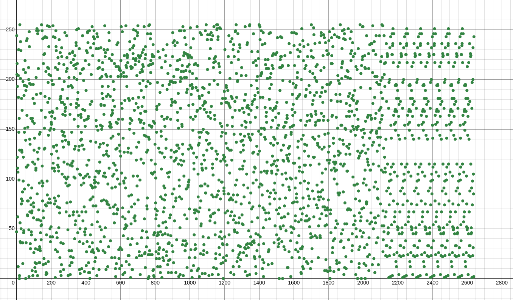
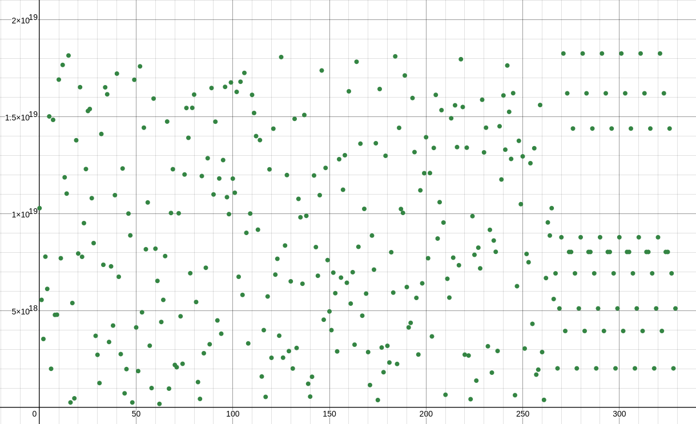

# Encryption and decryption programs

	These are 2 programs, one encrypts and the other decrypts


# Ready to start

(find a way to get encrypt.c, decrypt.c and libec.h)

```console
$ make all
```

In this logic of encryption, there is a notion of golden numbers, wich are:
- NB_BYTES=4                // This number corresponds to length of one information
- REDUNDANT_BYTES=8         // This number represent the number of times the information will be repeated
- NB_KEY=15                 // This number corresponds to the power of randomness in front of repeated the characters
- SEEDKEY="Toy-case-exempl" // This "number" could be better considered as a string that will differentiate each compiled program

The Makefile are editable so the golden numbers could be modify.

## Strongest configuration:

It is possible to increase _PUI\_ENCRYPT_, _NB\_CLEF_ but this number is complitely enought !

- NB_OCTET   =4
- PUI_ENCRYPT=10
- NB_CLEF    =100


## Worst configuration:

The number of bytes it's not enought to differentiate all the ASCII carracter stored.

- NB_OCTET   =1
- PUI_ENCRYPT=2
- NB_CLEF    =1

  
## To accept a certain wrong bit

Set this value as you want:

- EPSILON=0.75

It's a ratio like SNR (Signal-to-Noise Ratio) to gets a certain tolerance on bytes errors received. 


## results of increasing NB_OCTET 

start from 1 up to 8 wich represent a 64bit value

|  visual length   | nb bit |      decimal representation      |
|------------------|--------|----------------------------------|
| 28               | 8bit   | (0 -                        255) |
| 63d7             | 16bit  | (0 -                     65 535) |
| 2da435           | 24bit  | (0 -                 16 777 215) |
| 1f8fb78f         | 32bit  | (0 -              4 294 967 295) |
| 4855a7ebfd       | 40bit  | (0 -          1 099 511 627 775) |
| 4f554086a2b3     | 48bit  | (0 -        281 474 976 710 645) |
| 032006e3aad67f   | 56bit  | (0 -     72 057 594 037 927 936) |
| 3577179b3cb5a7ba | 64bit  | (0 - 18 446 744 073 709 551 616) |


# How to use it

```console
$ ./encrypt Hello world (press Crtl-D to escape)
$ > 90e55ad7346e9d82f2b7a8e0843d9b134efb5a9f4bd5a7ec337f8bd91f393481da9df921e95980121814fe8f79f77a0fbf50f6d05b61bb46b4b7727434e8c39bff6675e21722a115e7a67fb2658956fddec26f84a66f0173009aea8f70f86eb90f63b142376912f654ba0db42771360d62d1e17938cd7eb17ab89a079ab94d047826fbdbe21bb2a546d34c0bea9f2e854309e41e1c1d7954a6ce2dba8d67d4a721f0ad391b575b63e35da9b98e018ba8a3cb5908ab7fea71c997f057d66c35b9197dfa06bd8720b633cedbb6d654e4cc101ad88637106b005930696e7cdf99ab803c8f40f5803efe74eb23d0610cb92fcde932e1353394501ce0b590924221e2906be60f66ca698f12665623c55e44558cbda87d4bf7b2c0bdd0144906d5040bc50973fc08c73f91564de79748c02d59ad0143cdd879364bdb97d2fc9398ce38af7aae5d076a53593acbb10cb62eecb46df4df5e6e6f1f870ebbdbd39b1332df4200e2bd5441410702c8b9dd709962e8e36b1a6262dd7e58a67125018e0d986164a9aa1fac9289b32b5db9fad97cb479263c8a3b3c3129deb23aa4806cfc3790defde9f963e97197d1794a5459342e44fa054815e4e275cac524c39dc430ccfbd01bc5df96dd51b69429cb30a818c4a3752f072f2c256a9a04836ed834fceb09ce3b4436db8902f111ffd32ec48dad0b731a66991198f5ba1cc0b2563518c2b6004b24901ec39296bbb0ae4b622aa9a77659111a5cf8c7911ce972d5590b8e82d0cb4ca3c5a2be9fcfb96bd0e1a30bab2a584a49849c015d68ae82a69146770bf2626e4accdb5a590a4995dc1a9458a0e071ceeb2cceb203dacc892a928186af0ea1df8bec51504e4421fd0eb66ae6b88fa0decd24e920274d8a5b8e81144540f4b62f0a264f37e4a6d59a97f164de6fc58b434fbddf9d69ebb7c7f1d90524b71b76e6ca674e7143a474281a12d801ab6d7af4c341771d17e638e5a34a9fb4406c1d29ed652a50ac833d86231f2c3ca11fdd3df3a15c6f5f176ad6dbba0c295f3a69aac49d75882b4721d67d357be97ba3eff75b138b2b8899cf28a109a48f8b4b0fd01f8bb31f38aa8b047845004bfc30f5e401d9e26fea14ef1c64c5e055d09b7d7afb3dfe28ad04d1984f9ed1ac8cf776b3f68e8530683ffbdda2d95780514246dfe303636e5d03772d64879503c8c59a8da1fc5d13a1ddf86af373477cfc23505394eccd8c03c80f11cbf63eca45b1a7e23b5b38f53087957e22807ea73a6c1c5ab664ded8c53eb654a640d17978dbb37113d268847cc5cd77ca078b073127360aa35b81622690415a5c63698556a4aa91f94178487ece09dd20d4d364a67afe1980cdc60e4cf5e8218e14638545aa546a707e435580f8b18f23003826d28459afda3d5b552f0ae72d22c973595d0b16b617e8c8487561f4ee9ade20c8fae257c0a81ec42151346634848acf9d387ee93569971968e44c7b0baa688b6644b68dce5229a7cf3e37db6dd3189f6c8912b1c1aabb0d13b5120e65be8f6498e4b041bf34861a9240c1328c1e4a95b5ab6b5540988a30b64e6054e249259cdb82a556b4105bdfee3e06bbd16a34be4d7c744d23678e4bc3800b66beac8a9571488bf4f78d5d8abdec542bd4a4524483b6c9b885ff7f3b8da833a32b913566b6b2b8fb5c120ecfe52aeab8e26fa5e77bf185d73211d852db8451b0e73357dcce21f6ca2666a38107555f8ff16753714ae6c0d4560fd1cb0f26aa33b76728c6f3f94e509fac88e5de6b42418da83990c9e9183c2b92168db729999d9c79dd0781436237619faa0646bf3e91284a9cd34b36316e463e63b4234ad302a7f599f4cb4101355ab91512374e7a93dc3007eb10e7ad87c44ddb586bbef5c69a5a27e9df8a105aa865b6741a6a32b1171510fefba19eea76c4b6dda321fa0dbdf2c449dc31a878d608a834fe4296bf209b4201f38dacaa5db9a36720d02532f005ef7868e70832d9e7680e7102d87c27f59856b410d537a21365ec4d336ff936f3e53aa6c154f08cf25665320cb6b1c489f49e3651b5a433822cc6c5872d8ab5d38b4b1422bf12fdf09d24817b9f48064bea5c116240a25d5834c6c3a64fc45d6b8a2990ed45418d8a2e90ffe5d4854f2874acbad6b09fbff199f7e702896378730f57c51063ce8df859384fa0e7a7ef91cce9e1612a5d32100499ff3c64cb0a4cfad9a63ab68a51e09f499ccd86faaabec79af5df5797fa12cbaebfed8ae57ba643342a5895aca933fc6f9cdf508617804b8ba91babd0af3535750ebd338866087add9b7296172120f66dd4506024ebe88c64c1ee6a204122de09ffe0abf6f9e378ac6efb86d6417bb89a26c641dbfa669ba94af89b46ca0893a5b1c256f804a5fe91a02c631b4712fc0859204aac9078cb0658ebd891723b78bcb12fb8459d21705e881c6811839d55fdc1c7b2d475e9103292c76bdc5a2e733b2b56a7d2c538d11dfa92d54824ac9bf7847603ddf29a32c2afee96100846760687ab2f2bed4b186f6b840bb67a29556e1738ba9eb7c53ecfc5694ce757656d732beba681a40c5196ef61d890ef451ae9bc6dad4c36b48e36f95708b6b82b1e7d98518f01982560ff06e6b62d0ec174ab811cd6c91e3fe8b71172fed75f850d995cdb72fa0df39a73cd2d26554875695dbcec2f73ee11c0ab7e0e3c6db79adf5c815d3e97201267de30297e044044929fe4998835afea7abcd6140674e4c86653c812f4cadf76595e365709773eb1f6c77aee7b06a12b5623985ac5a5bbcea9658e3c9c5cb154274d345626ae13675de97ce12d33ad3d600060e61bd97e967d35f599c5f2ed65fb6a9247dcb71f44a87d746e2014d747dadcb00817a54dd93650d03b33d062e9fcbd78113508d306145cc180003fb9388976afeb9b63b9cf28bd7050fb3f1872c9d6217b3e4b9c168c579cdd2a2be6d4c4be87bab819b7f96ad390b5a0d065940f0689504c6c27b372c1a81588ef5c19447542a31439c1cf3eb038c98aebefd173ad31f5d120a100622c6b6cb88b2cf1b38f7295f6ac0899b56a565066dc696e3200c557a76faeb46c2dddaebf63ad3be005aa1083974ce030226b6cb3eb028ad69435db5364c4ec84f1eea9a44661c15759d3eacc6c67cab5233835573e266e65cb66f2832a959704b27b8537fb930d47361413fe44757672d6cbdd36d87505aaee8cfa8f7f17779381ac3edd45caee652e9ca27c0265eb1a2bdb00eca2f3bff4aa424821444934d3a7b422afcad3feb24c1582b38801537d51647fe365c8a6bc0d4a555f6475a9f2567daf8f284e0882c3bccaaaa40f976108210084c04ff930797c9875e670a3db7ccedd19aaf1fe7241c756071401e598821318724846773f895478297655f8f97cb7c1c2712251c2046aada9874076f3cd743b1c60f53ade3015aeddef355b5b8ef2f2c1b81d2f94256ecbf4f442f5f371110cb8cea8a5b3325f9e632af3d5a0c7d845e22125fd6172db5fd3d680a29feca13bb21fe18ab5c113eecce7218f4ae7f7b2630052ed1d760f3c2feea2cdaff539fa9be6f566be488782bc003ad9a9cff10f9104e40df6147e0108ffae3a622a6e657082e304ed230e5354678d2a00fd00121e5ad03e63a686e9e8de24bdc9e285936674e0c829c5bff563385d2a2cfd4db5d85bc53fc52a671d00ac51651551d503b0d7ff14be97a1c0b39d4260d16160599f567bb1787ae733a469460d83892811d4db311e180901f7e0243c621798ebce8dc567c878f37e6bb3e1e011073ba1f4472bb6b2714804f58ca39334eb1d085d842a5b537d65a16daea83ac8e7a269619366bcb4e86164cfeb2dcef8902f4b7b3ca778ad4abbb82a2ecd5cdef8da0aac3eb1b778db397f74d3972f1ef528e81bebefa1259da6d3e89ba4057fd648f578dd37192a3c20cf5eef28b7578c92f249c099c64b1cb35d1714c3e89e2e2a814a8ba8b733c1f1b93b78802dc041d89605cb94292ff2cf6483a4ba41e57450a0dd0c393526227ad4b286714197a21269dc5279e6e3bdb94d5fd9259ef165ecd55c7b8f0131ea0988628d95633f4746c9a8f4ce5df6f8bcdd74b32a058d6ee5aab60cce444210977c09d4cdcd75a0297fd31add8ef2259c34e25d2566cc5b60ddba55a482150dfd1d641ab1b5a29b91773d8df6492a54a83bc51dacf88acc5e0d748c59283ceff51caccbd4bcc18d9e49063413ea6d33666e94b41f9797603e069b0c374dba0781a08b1b97a7b79cdf862e9925ff30a6a6e1a6b48887a0e56cdb29ef4f9fe3189d919cc3fe053fbe5dac058d6f0edb3c23b116a27ea3f4edc5f3b90f60c444b045f30d31574735646554ff2ef83e351daa4b1f09b12f91951eba14ded6540b9ac5c0b9134ffa82aee8e96c74b3f7f23ae88b973a197bfe62c6920135b822a050694af387b58fc62b3f19fb29f7fd92665bc60598c700080ff61459264e503430acc3c6bb39ed672c99c3e81fa5089956f886253d2d4fa6a97186a676176a8793c8589f80990ad06a61e767b77a290574872ac3c4aa25aaf00445619ad4ecfbddcc57555d9df7af6c59b834ae57e7752aad60cc9ca2b1ac972186b5b64064d31a90664552e2e9f314462901c1663d78fc592a4ca15ec4f975339a02c7a19697c1e244c3a6ba0066ee1a35a68dd39705f81f717afdcc45534dae3337bfe5be1367a90ce0c194c63cdb7e3767876467fa70d0c952826a7caf3dc0ed6a14bf853e42695d3c98efa74204a150c36d202b8b80aa78d1f7b12532dc008a49529fc8decee0afeae241f2f3332c51eacc6f63b5bb9da2917e7ecdf30a35bc3c9d914e3c205f2cc5c028f50a188893da4aead2d534622cbf9ae39e95ce0a1873f1bb719aa6242a3609e96aadcd874c511402fd38ba1b9631453dcaacd40b5aa9e18b9e910fd1432b9cd6356a5ec5e03ef51bb7a1fb78d3637dec850ed8317ff19dd551560af1cbd3875880e65451d2718fce20db88512865c1c9cd983b2c7fcb7c04be7b011870b832e9f65ccf03a4124ca07de72b916dc1012733d734a47eb8bf02597954094608455d774f58a7aae85b3bed156d2146884e6a487da58075b9e96a730e5f9a270731b5b3142ab828b951e86bf76e6d09a887b034d8813937557a569bf30a826d180c4ea7e91c378d2e008a673010fa9aea466cdfea30a738c2cf5818941dd0b842fda2ef9bb6892847cf8163d3e8a8d143af106c456531ea18324f4bd11897c79b7188a2763d93045f560b9694c758d0909e53e484e87a04995bec55be871176bfbbe37a1dc48768f42a57ea4b48191ae4dcc8dfbac55ebb9ba8ef56fe6fd30a9843f1cfe727f32b4535c37b12f83ba878797b7231533b8df0e75bb5d3c8a9935e2f1cf72118fd85b8f5881fd965666e6caed1aaa137f038f78d49aea414b3f9d0da38029a2523a65855ab12f1524199a802334a525e90ebf62f2e040f033e772833e94c97c32bdb79f443b4ba46bd0f5f5d694e17b118bfb70f45b01e708f795fed1429385c29a947ba04add82768afe8c82a5abcd8819fa3a85949628dcbfd3372e6d6eb2801bede72005e6e9f0ee901c476e4c80d4f5edc5be1bdec15a7443b38cb5397b78603f514cd395db44b16c7a508bbd51ff89d560f2ad0ff37e50bbe9dcdf15385d848f2c910906de7bf0d29b074149e346462d26d3551f1ba82ddee9fe6305346634fe2c95b6b061bc82d428a9a557020a8fafd7e9372d411ef427f3513c7ec87fef0e4a4162a59ddf96169ba282bc1cfebb1e40028d95fc3af8d6ca00a18c5a92c777f5593ea531cac1ac4c7cd83f4b6ee24f90155c047ea7e64f8859167f1e00fc22d3dc235f40abce53ca4c351f42403ebe7164f0ac2be7f205b504516f901d88558b839f5c0ef48b1d3aa6f78bd2f3c9c5426399895a8fed86d529b92cfaffe7bba764e4571daac4172186828b1dd56267c4517da51cf2cc02f84687a744ab91947cd3390aafbce5ff5cb2b766ff4708f314d8f9b12e0e5f5e9a0bca91f5e0f3d580ea9a7cd74e99c9bc4fd9a821f41908f7b3efd6aa69e5f30d83b70ae68e147c7752fc9021214231f744dd2e39574b28636831a7a6e62b3fac0fc34e406d5999cc5c39f0e25fd91cdf3ef210865f46c62348fe82e1bde4e70c20fce58791106d6a66b10e3307cf00449db327ee0a21c81f4c9a1aa23da8d6447a973b79f0a8d7891ef813705aa95f9d2d7d5fe02994dc611a92c7c1ae083fafe0e14175cddfae1d2bd5252460e1fe415a6e1866b51364ab5072fd59f36b1a1ed1f6638e9246f2ded4eec817bcdc0067f0d55b57d78536b89b6cce76b98870e3afa289229e51dcddbfe9a12a13914a2ea3803d91433b3972bbdbffa4cfc1a9aad6aebed16b2c40e1bd20152dc4113fb83d1a7139adcb6fda441a55b7e6d97d253c00221e5ae292be61e15edc1337592a90cc34ee50c52424d74f625bba88b8475f852213312990b21d2ba18dff0a3953bd2c3a0ae09afff89c663a5df58e844fedb026e7b879b6a9e69689ad7ee4afe197417c0c6366ffa3f2c2c1c6e1e1940ab9070c62f4e60fb70b48e2b19e235c68b0b6afad4f7e4bb2d867648ad9d324965308c17942cb15f7956efe4c9d0a8a643172d5a7c10b2503053d08e9c3e0e77a8af03d25685d908178b67ddbf965f5d9c0e5507ff477f2c7fe707bc8172d3d74469e90af68b17e367564f776d965e80dd7a1d5dad8787db2a221941173e432f17e79a91145241952c5333c4e1db26c3bd7480f1fd3422ebb0807f4f357a9bae5185d82fe2a3303c44bb712c686ad81454ffdfa9306621666e6d155e40d5b2e41da98662584b7a9ed56a2a16c57af1c26a1a803ffc7747b9a8ca23628a41ca98dbd50afe7e9c20125825daf2ef4b542e942ae6abf5f66ea1fec5dc5d66e1ba2f5db95e0b269cc6bd9b7ebb63292f11e2b8d7ed07d9a8eb7e83f4d1a713a6ce9fdd93cee5d2bdef5a807c75f9219bcaf6232b74a24ad3476443946a68c5da0f73db3c5f62827edb3d17f036a9b41d5a24c79df4a3b9c2172c0b3b54cb29399b11a804862dfcf098e29252d0f6f174b8d9103cc593408b816c216b17a3d42ad8431ccc64b7f35e47c2e85d7bc6cbdbbed42eb8793ed9937cca63262b4c78ef84b52d55e28f669b19d4633ce426b94f28ade48ddf53bf6f9882cf6c05d6a7d1e9cff150e692e8ce63b01cc4916880e6c3be33d00010e40dd5059c2104104b6de5011e0df1837419149407258395e74521d589fd7be0ea8cfd192cdd7d02f6c4033a9943712bc2ad8d27e5c6f2a4bcd84c500987c1bca5db9761286f26f9fa3083a531a5f38d249567008c0422c82d7a2dba99d9f72f1bc571e46f6a0c7723e15e7a7deda8d933d1147ec59bc2a09911abb574d9d8336303c29b9629fea8ef8c6700494d0f77dfdf1f362e1decb82e9a1ac336d7ae72be4e11d469f5fa0f5ea40637e21a2203a1659a4ffae9071010f9baa414c55de6caface218473bcecb27151fed07c7f08a939c80cd46d7fd7dc47d8de2a09324126651279712440917fc183466d0023ba8a00cd46644ed3578a8c6f12ee879b32529f4930cdddb98e543db100cb9f67a81868cef2da3298aab612ed2a26bdc68d48b8403c8c91e1c9b89b41c55680374bf5b0e1af68f374eaeb1d7d658598265988a01b9814d562e915080a27b7ca20dfc9534fe440b4ceb5dde75b60e295848dda402ea88e753a9fb65261d444a4b96771c6baa255d1c20d0f87b55c00c41a97efa933ce68831b75d29873009764de366d5872855d7edf36eb5f78271e53585d2c49b387b7f65b77ba83d5f6c29709bd344b736d45191f71873576a70a9602b7aac12539b4e3ca626476baf8baeed61862e3d269935e6518083b54c29a3ecabcae39078b394f94dd4f83c6a659f6fca30f90eb676bf5060308be3237defed23718fd48afcc14318f78b9acfee7c956028cc1afcf2417a35962275ebd97abec4891e409a95b2f0b7834354eae0f600c622229418ee957f2081ed160ec17c7b61c9cd1038492bf6cbee69b7c22885a6683ddf64a732f53f5b0ef44a325a1d2e7dd9efb86030a09a11545baf821ba6007bb8eaa2af3a0d62638c2a9f93fb4c3ad5d4ac91ec72b0defc52d4a8e9fd6485973a288531c1e50099b529dc8023ea8f59d70640d1bd6da35c602999d6056ba11a6658426c3b2ed54146a916ca1d38cf25a57507820babe552b870484642d80d0b745137cf5db35c36843bd3513ed399fbcb2291704e8302c6b4b0ea3a28c8008a272723d1368a6b43fbedc396b5db29ff29d390b45f6ebb09875d4b294385fda3e8f1b3a29cef898a3ddaf14151cfc005be56aa72f4c39837790f87a7906e2443606f6a87d06298402d5e2336b87f4d3fc21eac16a6f44dc11e244d6d0eb8c07b0db418902a6f4a52aae7868595a341e8bc03e24f0c567702443acb0e6b1afa6f4d183a94f698d603a7020fcd31c36564fe92c2da962dcfb1342e0b89360a7dd5aaa6fc71710c0cf40e4da354b89b4482d78f0d2d5fce8f7b3898240f1fa1921e06ace113b788ea9bf8d9d178e403891b9feecdfd94e09a7512c6e4b620e84f53d303d6c3e17ee71335406bf0a86fd4a2668214f786ce1a16b15083878acc85225c75e5bf3f0853b20ac0a65a8b69ec86a00a2c8591de45ac6872e9e56bec4a59d88f55901fe4c97f63a57bf1c1702ed902d4b8aba4c957582a5d4711d059ef4b46846b92626aa9eed5bfa648da45f6ae2f262ff66b601ee073431c1661760f9edcdfacb340b7d8af31cc02bb69ced4f7c160a5148ff32430d32e76ad6a9042f5754cb9a4f09d184b7f9af970358be8a16efaecda281639d40841ca7f0a77ca57649d2af7ea5743cc671360bee4cea8e510c3b0406783172e103c157b20ca5b8c9212c22364d4c6de0084e3091104ea1f545f23e1f89a7b1bb06880e3785dd56900a285e143c218a47bc3dee5350f5799011bfa6c55b0d4618b96b349b7787f67c18ddcfc67c52938dd96b3bd8c2c723d99f9b3abbe1f7be82ba2c5f8234964af8d52dfb0bddc971e39e446e8e85975d3dbd93cadf9da7ea1b7678104ca11074eccc926add040f0dfd6701fae34ea86c6fe3da37bb3a52bbdabf8189878bf43b209dbc0e0e7759ec1ca5698911ef072278a8e1934c199c693811d63d315c67f70e3d6640cd1fae744e8ac9f6d1dd4950435bbaacbcc847474da11d60d24ee3b36cc45d507dc3650b62042a2b368cdfcfb28aa4dd51879455869bb4932988a18c91677da28a5814c73044a28a636125a2ddfb22cabd8ba6e4f0b06db4c1c1d42667e4167659d4aba52aca99a3f0120a8361fe229b8ed4a23a7cfe20a5a469b71154ddf285a9b6f800b61fdb62f6f9999da75e1b37151aef0c1732e06e9801f7df02ac5703c1dc85eb98001728338675b9e2f3e553bd6ad5406763dd51099a107d76037c01a95082234b3e1f862d3a61dee796a69a4fc57ecc31c3a87861cf8e73d22f043afe912b70611aa6e363e96fbcee242d940ad050b5f009db88233d8e6275f85777dc6a007e7f09c81280434ae5b3e422b6ae7807aca448520ce514c28e17231387546ad9d6d334525fe1d0e2459c3c38f96cc60ef1101db044ef8fdb8f8a24bda0163f0cc0b31b63784111047929d76b212d04dcd950fb6e8d6d26820992d5a24d29accc5eddcbfc13f48550ccf60bf0859dca1730a3bee76b92c1d22ef0b92115e27b77f19de7cc2c6c7485b08051d0daa00253f1cc92a7b9c031528a7623343227daf9c3b1ebd496075161a7a3a22ff8482504bcd6a04f65f99644e068bbb2d06b733168232bec0a775ed5b10248fdce242308f779dd024bac2830c7e1567035d8bf265e8a85c8c61b1a6d08f3971b6d77a93ae2a39c02dda69b2bac42fd70370bb347c47ecb9fb61c5771d7254be6eb67617030c86ada65e488513b5e9ec05007d4112aa9b47ed26a2308fb858a9ea8b725224012d0970ded12a10d9e974bdeb16bbf6bd18460a85db414ecbf2996bdb973a4732eebda34d5560e1a3859ea022ec524abe8af560012f5c97d928ad3f89ec29ab628739d3f47651ad53ad6a47e64c4ed598ccc3b61054a8f82dec77382b8440f2a642ded8229bdd9a9e8241581cdd6d608c09e7dafe53059019974f0baacdc46590fb8a4b265e585d1c1462b8c1e37ce1a368a5639f06e33d769d0a9a79f84ff1632b3231dcb68ce499f2e8f028d03b078be551a205022dc79a4e5eab1789c622d3d4a1faa888359a739204d695946915a67e114c24361787fa9be1192534491c82d91b6e2387a959d33b35b0e25b5574ac0822172bd8814442ce9e5ee3a383e2b13150f78ec2b0cabf9ddb2db28c8441c3d69113a9c441b4505ed8393ed3423da2223647662f17e40122281cc601304803ace9a5eda6a007135929272d4f0727fb450b6a667652667dbc7cfe106289fd7bfb5f52e20f6a26502581594a085c8de7222a6ba88a6ddf9289d7bb6658b639704916361cf21860737738947e4866d1db536e7022ea4ef82f5f37b08071bf550a3533d49c5e7a1e37bbc06859574b7dfa554cb45b21cd2138bf716197ec084d29a4eb96172d0ad782c3e10d95a854e77bf6d8a1121980120160bbc47e843d4c5398132eaf714239594afe165826c7202dde42a2a47c2a85696f2761fd8406b8a9e0e8d0d05f164eaaebcbe959d588b4f27a2a2ec2803877b40c5ae7b32f1747429d91e088051d07b2e9991609a0fbb64cb165c1034f0fb60dd2f2009bf93d7d4b374e6e40619bc5d6739120a399b6a6cd300237245c11b366861c657da7017ae77f2208de799ff8ecb1d13a4ce357519c6d52769790fc4bf99b8aa2c8ddcd6a3719188108e88701c405f0a8a54eb61f79fbbf610d63a58602791b4914c9857137b27e065758c050117963bb10a7bdc90a40a04b4069e1e3feb16401b22ac77cfdded936ccaac591d02e9d91f2e3dbd4c2ed010dddfe0d140ecd8b3400b295b3e997517c3ce8dfb6ba770f2a242b5d3a8eb8e27a31ae4ee5bdd839b481dc2bb6fcfe5a7384cf713c8da9d744d8f878f0224cbc3b8ea6acae7d5f34ccf337f07e8ed2cd4139329eb623eea785afcefd0daebfd23aa52d0ca33459fde4043e95c91679711d13bd022c7e3374132a8284f8f3f60eff50f01a97f5b4b1aa20cc202327036af0ccdb13d1fec09f97f7fe3c29ec64f45cfb59462f4e7f8ceafb5360bfa0fc46a4552c5fda62b45ad1233be43af5cd6009c9db7fe41ac29aa0b483fd1545fe23e9a975bceff3e1bfb92c992990ab87c7031413be68db6202cc1fd9f03f04a39058021cec0a4601310621bc82b361281b3242db295c8c133cc3f5af36b009811356330f328caf88f636fca6f3bd4f92cad0a9f7e022edfe3e609481b31291b1ff888d403e49d8b3baff232f750d141561c27666665092035278a789527c35f0dd9a76a353a53aff5f133a71e5583fe55f8801c4267a6825875e11d63fe5b86442b5875bd827913184143eed665b48950a1003b6b678c28840bbaa4c6efea73a8d614748759746c5d4bc1cdf611dd57d8e97ccb13f557f8937877d7a193b2fde98dc38812766c58f8c31f7930fa8b498d83e764f2a843db520755e523d0b60afe0282356dd5623d6f3183aaecab8b0322ad2b1e75edff0fad0505610414410ab02e2149e8c8707133aeba7f2594a10f978940d27f7dc72b0ebf0558ea7b2a3f26e95f7bddf3cc94dc161b09f6fde4178192685d72a4e03a58636d46570edaceb87ae3915830b1bb3dc8c0e99cb738835f4fa99c591c0e306dfe88281bd707f85ce5f8ba02e1017d2c956be6ee5ea7d2cac1a3bb31a22419575a2fc3ff7087744899f013a3204120c5e6d35ed7780306c8e72ff2c5568340d60a777c3fe8a6aafb903a3d3eeecd512a0e297ae17f34ccbf03e875c03adad0995cdc132168452e6caa3cd6db5b708bd1c5d8412eadc66b7168ee286decb339874f1d85be67de5da5a376d3a76943e8fb70d2ee1776703061f42d37340b74fbcb17fa29417dc7bc43d203cc333800eb56d510961052a29f533f7957b310498ab9e3ca4980a2e7f74d14ee1cd8310d94b70bca8f3427caccc5f60099acb3a524e215a9cfa0a63d5bfef992d6284e8b3c250d7c4f8ddc7c7908f58b92dfac8d9e09f24d3ab88ce92af9d0517f153e52b32af9d884b65d617234efe1fbfc3be5ea4d53173b0ea083f46248fa75bcfa491ee5065e7dda52793c56dd85787fcded34b8fc6f57322e6ed9988ec6855a38b22a65ff268db8d73c40dec88d36ab155bc2d4ca844d4e1f6847beafaa332103128fb31bbf66ef5b27afb3f9b5ad8d80a36e3f231f3895a62125fa87bf7b1ab48b02ab205f8f5b7b57c3655f2a887d8567901f68ac1926ba5317b87fdf47a6a705d235822042215927638f1e09f0e7c0cb29a478fd5f8f88278cf15703b8c993b1863cb58378d85d5f209c88962364b1208235c7a41037d8e633faad31f21354e6dd32880dd140f4886ed93bf0abc1468ac2d566676d46e1121dc440c70a64570a4da264d9e16fb373ba12bd2a771fdabf7ab3e37147bdb0481e7ac494c647736748159b6e0f6273c73c83ad63fb15fa81a586c5aba22fa46383cfe2a11f287ef9fe6ff4598aab9f1e6fb8aa24dbb7efa5c920c681de244db926d7cec4d06977a7cad536687180766f87863f8a3452d841b4b1e37bbdf54ad2615e863d40c2e4b3660b5ef5a43cf4901f8384f5a9
$ 
$ decrypt (Paste the whole message above)
$ > Hello world
```

This is done with this combination of parameters:
- NBO      = NB_BYTES=4
- REDBYTES = REDUNDANT_BYTES=8
- NBK      = NB_KEY=15
- SKEY     = SEEDKEY="Toy-case-exempl"

## Beter utilisation

```console
$ ./encrypt > code
$ ./encrypt Hello world > code.txt
$ ./decrypt < code
$ > Hello world
```

## Best utilisation

```console
$ ./encrypt < encrypt.c > code
$ ./decrypt < code
$ > ...
```


## To get it anywhere

```sh
$ sudo cp encrypt /bin
$ sudo cp decrypt /bin
```


## Limite and power

### Here is the stress test of repetition:


To do so I encrypted 64 'a' like so:

```console
$ ./encrypt aaaaaaaaaaaaaaaaaaaaaaaaaaaaaaaaaaaaaaaaaaaaaaaaaaaaaaaaaaaaaaaa
```

#### Test no°1

This is done by this combination of parameters:
- NBO    = NB_OCTET=1
- PUIENC = PUI_ENCRYPT=8
- NBC    = NB_CLEF=10

The results:

[](/picture)

We can see at the end of the message a pattern repeating itself. This is expected because there is only 10 keys for 64 repeted letters.
We can also see that it repeats roughly 6 times and this represent 64 divided by 10.

#### Test no°2

This is done by this combination of parameters:
- NBO    = NB_OCTET=8
- PUIENC = PUI_ENCRYPT=1
- NBC    = NB_CLEF=10

The results:

[](/picture)

We roughly see the same thing as above, except that the scale of the vertical axis is much greater than previously and this is due to the numbers of bytes on wich the information is encoded
